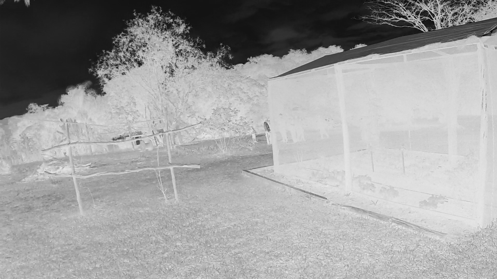
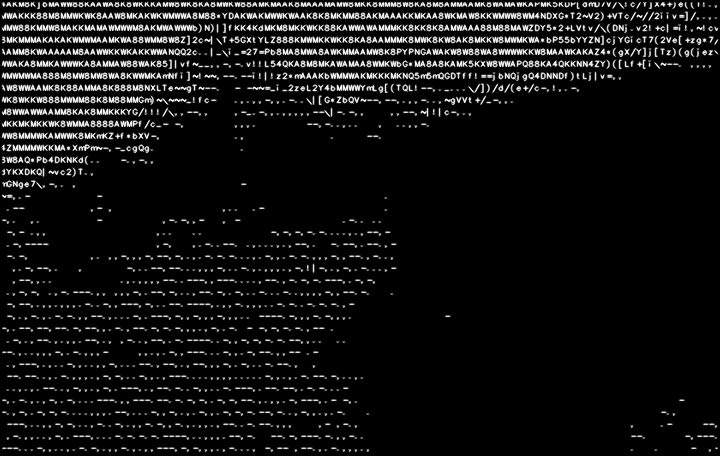

*AsciiVideo*

**WHAT IS IT ALL ABOUT?!**
It simply creates an AsciiArt video out of a video (preferably MP4)

**DEPENDENCIES:** This application use:
- PILlow
- bisect
- numpy
- Opencv2 (you just need thw precompiled whl, really, do not bother compiling the OCV2, it is not worth).

**HOW TO RUN:** It is straight forward, just load the arguments you need.
 -i --input          string  - input video file
 -o --output         string  - name of the output file
 -s --scale          int     - factor by which the output will be scaled
 -r --reverse_colors bool    - Reverses black and white
 -v --verbose        bool    - Adds verbosity
